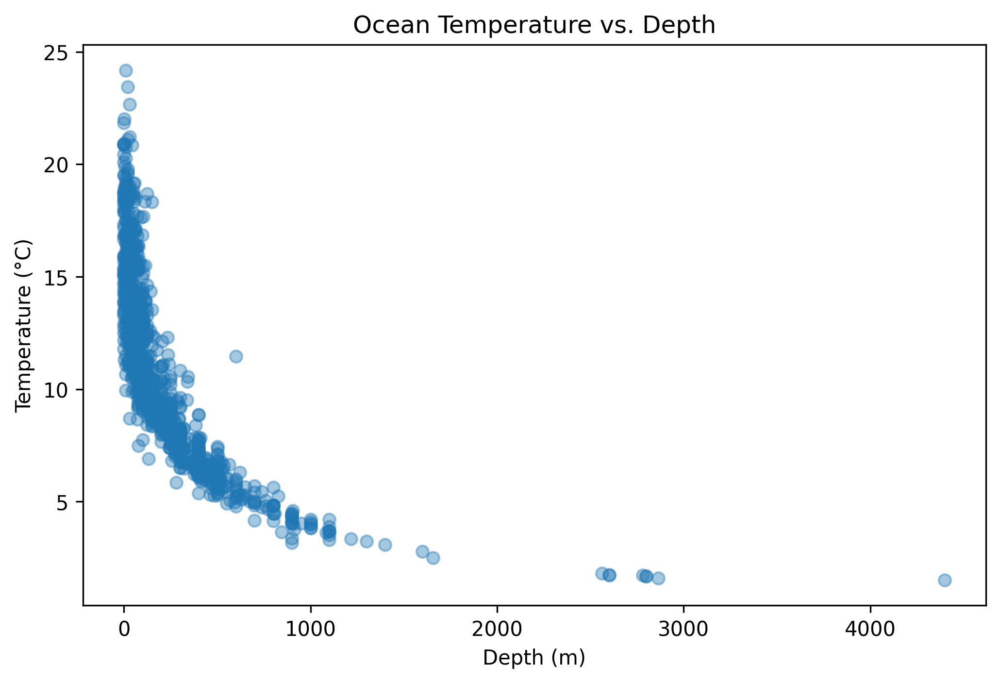
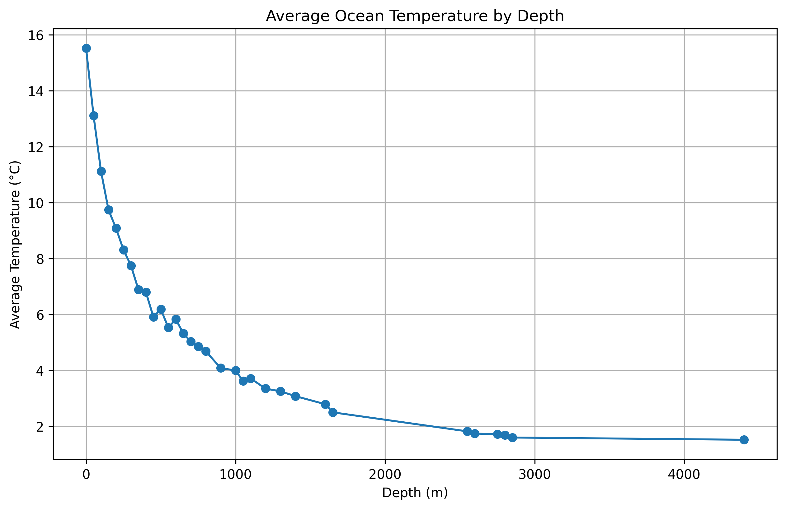
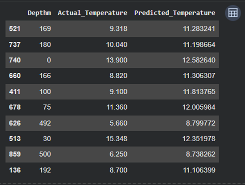

# Calcofi-ocean-temperature-analysis
Data science project using Python and linear regression to analyze and predict ocean temperature based on water depth.

# Predicting Ocean Temperature Using Water Depth

)

## Project Overview

This data science project analyzes oceanographic measurements from the
California Cooperative Oceanic Fisheries Investigations (CalCOFI) Bottle
Dataset.

The original research question was:

**Can ocean temperature be predicted based on water depth?**

During exploratory analysis, I refined the investigation to also ask:

**Where does ocean temperature drop most rapidly?**

## Dataset

The dataset contains seawater measurements collected at CalCOFI stations
off the coast of California.

Variables used include:

- `Depthm`: Bottle depth in meters
- `T_degC`: Water temperature in degrees Celsius
- `Salnty`: Salinity
- `O2ml_L`: Dissolved oxygen
- `STheta`: Potential density

## Tools and Technologies

- Python
- Google Colab
- Pandas
- Matplotlib
- Seaborn
- Scikit-learn
- Linear Regression

## Project Process

1. Loaded and inspected the dataset
2. Examined summary statistics and missing values
3. Used histograms and boxplots to explore distributions
4. Used the IQR method to identify possible outliers
5. Applied median imputation to missing values
6. Created scatterplots and depth-bin visualizations
7. Built a linear regression model
8. Evaluated predictions using MAE, MSE, and R-squared

## Key Findings

- Ocean temperature generally decreases as water depth increases.
- The most rapid temperature decline occurred within the
  first 100 to 300 meters.
- At greater depths, temperature decreased more gradually and began to
  level off.
- Water depth was useful for predicting temperature, although the
  relationship was not perfectly linear.

## Visualizations

### Temperature Versus Depth

### Average Temperature by Depth

### Actual vs Predicted Temperatures

## Model

I used linear regression with:

- Predictor: `Depthm`
- Target: `T_degC`
- Training data: 80%
- Testing data: 20%

## Limitations

- Linear regression does not fully capture the curved relationship between
  depth and temperature.
- The model uses depth as its only predictor.
- Other factors such as salinity, oxygen, location, season, and collection
  date may affect temperature.

## Future Improvements

Future analysis could include:

- Multiple linear regression
- Polynomial regression
- Additional environmental variables
- Seasonal or geographic comparisons
- Comparison of multiple machine-learning models

## View the Notebook

Open the complete analysis:

[CalCOFI Ocean Temperature Analysis](CalCOFI_Ocean_Temperature_Analysis.ipynb)

## Author

John Griffith
